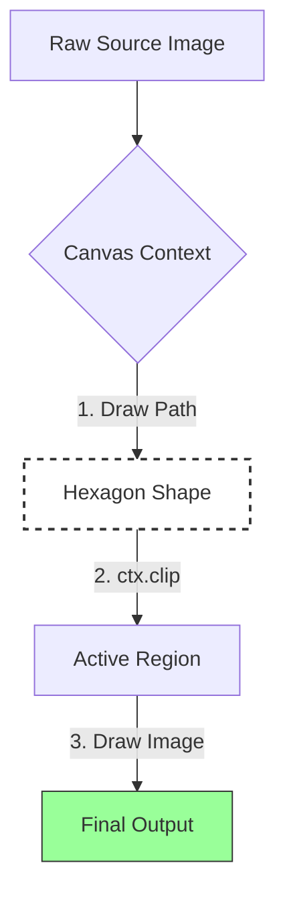
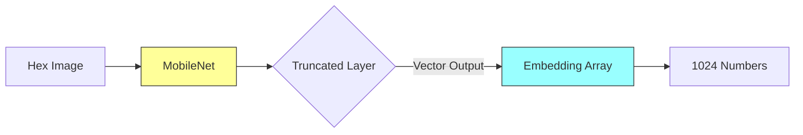
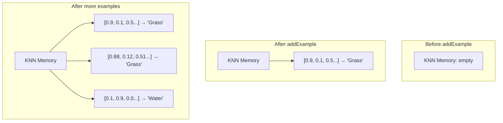
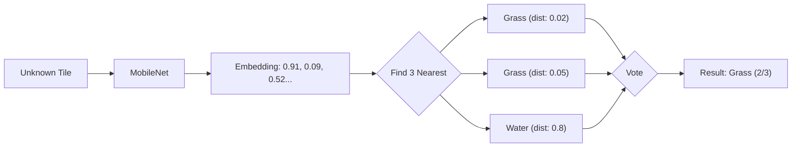
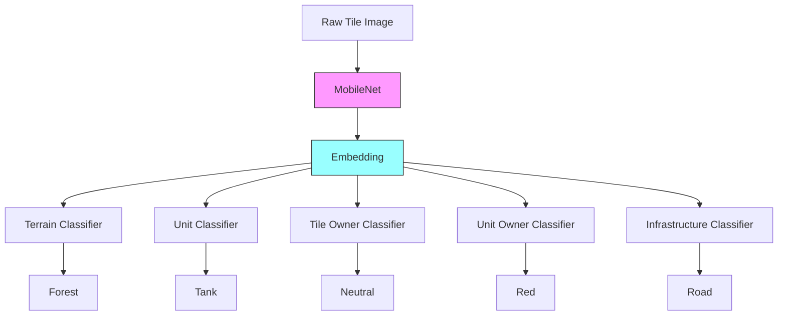
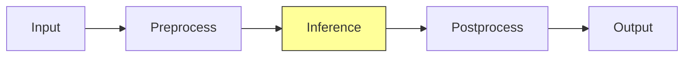

<script src="https://cdn.jsdelivr.net/npm/mathjax@3/es5/tex-mml-chtml.js"></script>


[DEMO](/demos/weemap-scanner/) and the [SOURCE](https://github.com/panyam/weemaps/tree/main/part2-scanner)

## The power of Nostalgia (again)

I really miss WeeWar. If you've read my other posts, you know this already. It was a simple, browser-based, turn-based strategy game that consumed an embarrassing chunk of my late 2000s. I even tried building a Flash clone at one point but gave up when recreating the pixel art assets became tedious. Civilization has been a constant since the original (though my brother can never get tired of mocking my utter incompetence at it). There's something about grids that makes tactical decisions feel more deliberate (especially hex grids).

**(Side note: if you're also nostalgic for WeeWar, check out [TinyAttack](https://tinyattack.com). They've done a fantastic job recreating the spirit of the game. It's great to see this style of turn-based strategy still alive.)**

This project started as a continuation of my [WeeWar map extraction experiments](/blog/weemaps). In that post, I tried generating tile extraction scripts with Claude's help. I had made a few assumptions (known screen/tile sizes, number of rows/columns of hex tiles etc).   The perceptual hashing approach worked for pure terrain - a "Grass" tile hashes consistently, a "Mountain" tile hashes consistently. You can build a lookup table and match against it.  But the moment a unit stood on a tile, everything got messy and fell apart. The hash of "Grass" and "Grass with Infantry" were completely different values. The algorithm saw them as unrelated images. If I wanted to recognize "this is Grass AND there's a Tank on it," something smarter than comparing p-hashes was needed.

So I set out to push it a bit more and wanted to build a tool that takes a raw screenshot and converts it into structured JSON:

```json
[{
  "q": 10,
  "r": 5,
  "terrain": "Forest",
  "unit": "Tank",
  "owner": "Red"
}
...
]
```

I set myself a few constraints being the frugal self that I am:
- Had to be easy to share/demo - This ruled out a python backend.   I wanted to be able to share a static site that
  anybody could try out (or even try out the demo without breaking bank on hosting costs).
- Cheap - Ideally no API costs - Gemini/OpenAI credits add up fast when you're analyzing 600+ tiles per map.
- Relatively low effort.    I did not have have 10,000 labeled WeeWar screenshots lying around and even then it was
  hard to know for sure if it would be enough.   So I could not afford a dependency on a "massive training datasets".
- Reliable and easy to correct - I wanted this to be "incremental" in its accuracy.   The ability to have the human-in-the-loop to
  nudge slightly to improve behavior was very desirable.

The solution needed to run 100% in the browser, using the user's GPU, learning from just a handful of examples.   Thus was born the **WeeMap Extractor**.  Let us look at the first part of the fun - The geometry.

### But First - The Payoff

Before we dive into hex math and embeddings, here's what we're building toward. Watch how the classifier evolves as we teach it:

<table width="100%">
<tr>
  <td width="50%">
    
    <span>A. 0 examples - No Predictions</span>
  </td>
  <td width="50%">
    
    <span>B. 5 examples - Some terrains work</span>
  </td>
</tr>
<tr>
  <td width="50%">
    
    <span>C. Less than 20 examples - We have most of it</span>
  </td>
  <td width="50%">
    
    <span>D. 30+ examples - Bingo</span>
  </td>
</tr>
</table>

A. With zero training data, every tile is a wild guess (in fact we have no predictions as expected). 
B. Once you add a handful of labeled examples (say 5-6) the system already starts recognizing patterns.  We just
specified a couple of examples for Empty, Grass and Forest tiles and almost all forest tiles were classified correctly
(a couple of landbases were mis-classified).
C. By the time we got to almost 20 examples (2-3 per tile type) we had a pretty clear classification of most of the
tiles.
D. And with close to 40 examples we had pretty sophisticated patterns being classified correctly.

---

## Hexagons are Annoying (at first)

Square grids are trivial. A chessboard maps directly to `Grid[x][y]`.  To convert x,y to a tileRow,tileCol we simply
have:

```
row = y / cellWidth
col = x / cellHeight
```

Hexagons don't work that way. Every other row is offset, which breaks the simple 2D array intuition.

### Offset vs. Axial Coordinates

When you look at a hex map, your brain sees columns that zig-zag. This is called an **Offset Coordinate** system
(rows/columns). It matches what you see on screen, but the math is painful. Calculating the distance between `(0,0)` and
`(2,2)` requires conditional logic based on whether the row is even or odd. I don't want to think about that every time
I iterate over the map.  Here's an example with two representations based on whether the row starts at an "odd offset"
or an "even offset" (courtesy of redblobgames.com):


**Axial (or Cubed) Coordinates** (`q`, `r`) fix this:

*   **q**: Column axis (slanted)
*   **r**: Row axis (straight)

The visual representation looks wrong at first - `q` doesn't go straight up - but vector addition suddenly works, and distance calculations become simple formulas.


For a deeper exploration of hex coordinate systems, Amit Patel's [Red Blob Games hexagon guide](https://www.redblobgames.com/grids/hexagons/) is the definitive resource. His interactive visualizations are how I finally internalized how axial coordinates work. I keep that page bookmarked permanently.  (The above images as you will notice are screenshots from his amazing site).  In this tool , I loop through the visual grid (cols/rows) to render the UI, but immediately convert to Axial (`q`, `r`) for all data operations.

### The Hex-to-Pixel Math

Most strategy games (including WeeWar and Civ) use "Pointy Top" hexes where the point faces up. The canonical formula to find the center pixel `(x, y)` of a hex at `(q, r)` uses `size` (the distance from center to corner):

$$ x = size \times \sqrt{3} \times (q + \frac{r}{2}) $$
$$ y = size \times \frac{3}{2} \times r $$

In practice, when you're staring at a screenshot, you don't know `size`. You measure `width` and `height` of a tile directly with a ruler tool or by counting pixels. The relationship is `width = size × √3` and `height = size × 2`, so my implementation uses width/height directly:

```typescript
// What I actually use in hexUtils.ts
x = originX + (q + r/2) * width
y = originY + r * (height * 0.75)
```

The `0.75` comes from how pointy-top hexes overlap vertically. Each row only advances by 3/4 of the hex height because the points interlock.

**You clearly do not expect me to expect you to "measure" the width/height of the tiles with a ruler right?   Dont worry in the next part we will go through the UI that helps ease this process once per map.**

---

## From Screenshot to Tile Images

So where does all this hex math actually get used? Here's the pipeline:

1. **User uploads a screenshot** - a raw PNG/JPG of a game map
2. **Calibration** - we figure out where the grid starts (`originX`, `originY`) and how big the tiles are (`width`, `height`)
3. **Grid generation** - using the hex-to-pixel formulas above, we calculate the center point of every tile on the map
4. **Tile extraction** - for each center point, we crop out that tile's image
5. **Classification** - we feed each cropped tile to the ML model (covered in the next section)

Steps 1-2 happen once per map (with some UI help). Steps 3-5 happen automatically for every tile.

The hex math from the previous section handles step 3 - given a grid of `(q, r)` coordinates, we can compute exactly where each tile sits in pixel space. But step 4 - the actual cropping - has a gotcha.

### Canvas Clipping

Hexagons don't fit neatly into rectangles. If you just crop a rectangular bounding box around a hex, you get pixels from neighboring tiles bleeding in. A WeeWar "Water" tile would have corners of adjacent "Grass" tiles in its bounding box.

Even without units on a tile, this was one of the problems of my last my p-hash approach - it failed in the earlier experiments. The hash captured everything in the rectangle, so "Water" and "Water-with-corner-of-Grass" produced different hashes. Same underlying tile, different hash, no match.   The fix in my previous experiment was also to clip out just the hex region (and setting the make the pixels outside this region transparent).

In the UI (which we will in more detail in part 2) the fix was to use the Canvas API to clip a hexagonal region:



```typescript
// Define the 6-point hexagon path
ctx.beginPath();
ctx.moveTo(hw, 0);                 // Top Center
ctx.lineTo(width, height * 0.25);  // Top Right
ctx.lineTo(width, height * 0.75);  // Bottom Right
ctx.lineTo(hw, height);            // Bottom Center
ctx.lineTo(0, height * 0.75);      // Bottom Left
ctx.lineTo(0, height * 0.25);      // Top Left
ctx.closePath();

// Everything outside this path becomes transparent
ctx.clip();
```

Now when we examines a tile, we sees only that tile's pixels. The transparent corners don't influence the classification.

Ok so now we have the geometry - we know where each hex is, and we can crop it cleanly. Now we have hundreds of small
hexagonal images. Now let us move onto the interesting bit - how to classify them.

---

## The P-Hash Problem (again)

I know I mentioned this earlier, but it's worth expanding on because it did get me started on this early on and shaped my latter approach. Template matching and perceptual hashing to me seemed pretty obvious. Hash each tile, compare against a library of known tile hashes, find the closest match. I tried this in my earlier WeeWar experiments and it worked... mostly. Empty terrain was fine. A "Grass" tile hashes consistently. A "Mountain" tile hashes consistently. You can build a lookup table and do fuzzy matching.

The problem was units. In WeeWar, a "Grass" tile and a "Grass tile with a Tank on it" are visually different images. Their hashes are completely unrelated. My p-hash approach treated them as two distinct terrain types. But really, one is a composite: terrain + unit. I needed something that could see both layers. I could have tried to segment the unit from the terrain using classical CV (edge detection, color thresholds), but WeeWar's pixel art doesn't have clean boundaries. The unit sprites blend into the terrain colors. The results were noisy.

This is where I wanted something that could learn things like - "this image contains Grass AND a Tank" from a single (or relatively few) examples, without me hand-coding detection rules for every combination of unit and terrain.

## Borrowing Someone Else's Eyes

At this point you are already thinking - LLMs and Neural Networks... are all you need!!   Why not just train a neural network? Training a neural network from scratch to recognize WeeWar tiles would require thousands of labeled examples.  Worse I'd have to do that again for a new game (say Civ). I don't have datasets of that size or richness or range, and collecting it would defeat the purpose of a quick analysis tool.

What is however abundant on the net are screenshots of various games. What is even more interesting about these screenshots is they are pretty high fidelity and have a lot of repetitions that are great for learning from. Eg in the following screenshot of WeeWar there are a **lot** of similar tiles:


So it would be great to have a way where we could take an existing model that was already trained on a lot of images and repurpose it for our task. There is thankfully a name for this technique - **[Transfer Learning](https://www.ibm.com/think/topics/transfer-learning)**! TL helps sidestep the need to rebuild our dataset repository again. It is (at least in hindsight) a simple idea - take a neural network that's already been trained (in this case on millions of images, eg ImageNet), and repurpose its learned representations for our task.  I used [MobileNet](https://huggingface.co/docs/timm/en/models/mobilenet-v3) for this.

### Why MobileNet?

I actually ended up using **MobileNet**, a lightweight CNN designed for mobile and browser environments.  Seems like a bit of a jump but when I first started googling "image classification in browser," most tutorials pointed to TensorFlow.js. And TensorFlow.js has this nice ecosystem of pre-trained models you can just load and use. The main candidates I found were:

- **ImageNet models (ResNet, VGG, etc.)** - These are the heavyweights. ResNet-50 is ~100MB. VGG-16 is ~500MB. They're accurate, but downloading 500MB before your app even starts is not great UX. Also, these are designed for server-side inference where you have beefy GPUs.

- **MobileNet** - Specifically designed for mobile devices and browsers. The model is ~15MB. It's optimized for speed over raw accuracy, using "depthwise separable convolutions" (I won't pretend I fully understand the math, but the result is: smaller, faster, good enough).

- **EfficientNet** - A newer option that's supposedly better than MobileNet for accuracy/size tradeoff. But when I was building this, the TensorFlow.js support was less mature, and MobileNet had better documentation and examples.

MobileNet was trained to classify images into 1000 ImageNet categories - dogs, cars, furniture, etc. It knows nothing about WeeWar. But thankfully the [early and middle layers of MobileNet](https://medium.com/@godeep48/an-overview-on-mobilenet-an-efficient-mobile-vision-cnn-f301141db94d) have learned general visual features. Edges. Textures. Color patterns. Shapes. These features transfer across domains. The network's ability to detect "green textured region" or "metallic gray shape" applies just as well to game sprites as it does to photographs.

The TensorFlow.js team even provides a pre-packaged version specifically for transfer learning use cases:
`@tensorflow-models/mobilenet`. Here, I load it via CDN scripts in `index.html`:

```html
<script src="https://cdn.jsdelivr.net/npm/@tensorflow/tfjs@4.10.0/dist/tf.min.js"></script>
<script src="https://cdn.jsdelivr.net/npm/@tensorflow-models/mobilenet@2.1.0/dist/mobilenet.min.js"></script>
<script src="https://cdn.jsdelivr.net/npm/@tensorflow-models/knn-classifier@1.2.2/dist/knn-classifier.min.js"></script>
```

This exposes `window.mobilenet` and `window.knnClassifier` globally. In `tfService.ts`, I load the model once at startup:

```typescript
net = await window.mobilenet.load();
```

You pass in an image, and you get either a classification OR (and this is the key) the raw feature vector.

## Embeddings - Why does that word ring a bell?

If you've worked with LLMs or RAG ([Retrieval Augmented Generation](https://en.wikipedia.org/wiki/Retrieval-augmented_generation)) systems, you've probably heard "embedding" before. In RAG, you convert text chunks into embeddings (vectors) so you can find semantically similar documents. 

How do we use them here?   Well here we're converting images into embeddings so we can find visually similar tiles.  Instead of using MobileNet's final classification (which would output "Golden Retriever" or "Sports Car"), we could just tap into an intermediate layer and extract the **embedding** - a 1024-dimensional vector that represents the image's visual features.

If you think about it the intuition is the same:
- **Text embedding**: "The cat sat on the mat" → `[0.2, 0.8, 0.1, ...]`
- **Image embedding**: [picture of a forest tile] → `[0.9, 0.1, 0.5, ...]`

Similar inputs produce similar vectors. Different inputs produce distant vectors. The magic is that MobileNet has learned what "similar" means for images - even images it's never seen before.

This was a pretty cool ah-ha moment for me.   Then again I **am** an ML Noob.   Still the ah-ha moment is legit!



```typescript
// net was loaded earlier via: net = await window.mobilenet.load()

// The 'true' parameter stops at the internal activation layer
// instead of the classification head
const embedding = net.infer(imageElement, true);
```

The `true` parameter is doing something subtle but important. Normally, `net.infer()` would run the full network and give you a classification like "tabby cat: 0.87". But with `true`, it stops at the second-to-last layer - the "feature layer" - and gives you the raw 1024 numbers instead. Those 1024 numbers are the embedding.

Think of an embedding as a fingerprint. Two images that look similar will have similar fingerprints (close together in 1024-dimensional space). Two images that look different will be far apart.

*   WeeWar Forest tile A: `[0.9, 0.1, 0.5 ...]`
*   WeeWar Forest tile B: `[0.88, 0.12, 0.51 ...]`
*   WeeWar Water tile: `[0.1, 0.9, 0.0 ...]`

The forest tiles cluster together. The water tile is far away. MobileNet has never seen WeeWar, but it can still distinguish visual patterns.

## K-Nearest Neighbors: The Kindergarten Algorithm

Ok so now we have embeddings - these 1024-dimensional fingerprints for each tile. But how do we go from a fingerprint to a label like "Grass" or "Tank"?

This is where I had to think about what I actually needed:

1. **Few examples**: I might only have 1-2 examples of each tile type
2. **Instant learning**: When the user labels a tile, the system should immediately know about it - no training loop
3. **Explainable**: I want to understand why it made a decision
4. **Simple**: I'm not an ML expert, I want something I can debug

I started looking at classification algorithms and honestly, most of them felt like overkill. Neural network classifiers need training epochs - an "epoch" is one complete pass through your entire training dataset. If you have 1000 images, the network looks at all 1000, tweaks its internal weights a little, then does it again... and again... for maybe 50-100 epochs before it's considered "trained." That's a lot of waiting. SVMs need hyperparameter tuning. Decision trees need... well, trees.

Then I remembered **K-Nearest Neighbors (KNN)** from RAGs (and Andrew Ng's Machine Learning course that every software engineer by now would have seen). It's often one of the first algorithm taught in ML courses, and data scientists sometimes dismiss it as "too simple" or "doesn't scale." But for my use case, it was perfect.  Or may be thankfully I just was not advanced enough to know any better.

KNN doesn't "train" in the traditional sense. It just stores examples. When you want to classify a new image:

1. Compute its embedding
2. Find the K examples in memory with the closest embeddings (K=3 by default in TensorFlow.js)
3. Take a majority vote on their labels

That's it. No gradient descent, no backpropagation, no training loop. You show it an example, it remembers it. You ask it to classify something new, it finds the most similar things it remembers and goes with the majority.

### Why Voting?

The "K" in KNN is important. If you only look at the single nearest neighbor (K=1), you're vulnerable to outliers. Maybe one of your training examples was mislabeled, or the tile was partially obscured. With K=3, you're taking a vote among the 3 closest matches. If 2 out of 3 say "Grass" and 1 says "Forest," you go with "Grass." I just used it as a simple way to reduce noise.

**Why K=3 and not K=5 or K=7?** Honestly, K=3 is the TensorFlow.js default and I just kept it. But there's actually a reason it works well here: I often only have 2-5 examples per tile type. If I set K=7 but only have 3 "Mountain" examples total, the algorithm can't find 7 neighbors of the same class - it'll pull in unrelated tiles to fill the quota, diluting the vote. K=3 is a sweet spot for small datasets.

Higher K values (5, 7, 10+) become useful when you have lots of examples and want to smooth out noise further. If you had 50 examples of each terrain type, K=7 would give you more robust voting. But for few-shot learning with 1-5 examples per class, smaller K is better.

**What if you only have 1 example per class?** Say you've labeled exactly 1 Grass tile, 1 Water tile, and 1 Mountain tile (3 total examples). With K=3, the classifier will still find the 3 nearest neighbors - but now those 3 neighbors are *all* your examples, one from each class. The vote becomes 1 Grass, 1 Water, 1 Mountain - a three-way tie!

Looking at the [TensorFlow.js KNN source code](https://github.com/tensorflow/tfjs-models/blob/master/knn-classifier/src/index.ts), ties are resolved by insertion order - whichever class was added to the classifier last wins. It's not distance-based tie-breaking as I initially assumed. The code also handles another edge case gracefully: if K exceeds your total examples, it automatically [caps K at the number of available examples](https://github.com/tensorflow/tfjs-models/tree/master/knn-classifier) (`Math.min(k, numExamples)`). So with only 3 examples, K=3 becomes the maximum anyway.

In practice, ties are rare once you have a few examples per class. And as soon as you add a second example of any class, the voting starts working as intended.

### How "Nearest" is Calculated

When I say "find the nearest neighbors," what does "near" actually mean in 1024-dimensional space?  The KNN classifier uses **Euclidean distance** (or sometimes cosine similarity) between embeddings. Remember, each embedding is a list of 1024 numbers. The distance between two embeddings is calculated the same way you'd calculate distance in 2D or 3D space - just extended to 1024 dimensions:

```
distance = sqrt((a₁-b₁)² + (a₂-b₂)² + ... + (a₁₀₂₄-b₁₀₂₄)²)
```

Two forest tiles might have a distance of 0.02 (very close). A forest tile and a water tile might have a distance of 0.8 (far apart). The classifier finds the K embeddings with the smallest distances to your query embedding.

The TensorFlow.js KNN classifier also returns a `confidences` object showing what percentage of the K neighbors voted for each label. If all 3 neighbors voted "Grass," confidence is 1.0. If it was 2 "Grass" and 1 "Water," confidence for Grass is 0.67. This can be useful for flagging uncertain predictions.

### KNN vs Vector Search in RAG

If you've used RAG systems, this should feel familiar. When you query a vector database like Pinecone or ChromaDB, you're essentially doing KNN - finding the K documents whose embeddings are closest to your query embedding.

The difference is scale and purpose:
- **RAG**: Millions of documents, finding relevant context for an LLM
- **WeeMap**: Dozens of examples, directly classifying an image

RAG typically returns the raw documents and lets the LLM figure out what to do with them. KNN for classification takes it one step further - it votes on the labels and gives you a definitive answer.

### Teaching (Adding Examples)

When the user clicks a tile and labels it "Grass":

```typescript
const classifier = knnClassifier.create();

// Get the embedding
const activation = net.infer(image, true);

// Store it with the label
classifier.addExample(activation, "Grass");

activation.dispose(); // (memory management - more on this later)
```

Here's what's happening in memory:



The classifier is literally just building a list of (embedding, label) pairs. No matrix multiplication, no weight updates. Just a list.

### Classification vs Regression

Quick aside: KNN can do two things:

- **Classification**: The label is a category (Grass, Water, Mountain). You vote.
- **Regression**: The label is a number (gold yield: 50, 75, 100). You average.

We're doing classification here because terrain types are discrete categories. But the same approach works for continuous values - more on this later when we talk about potential extensions.

### Predicting

When analyzing an unknown tile:

```typescript
const activation = net.infer(unknownImage, true);
const result = await classifier.predictClass(activation);
console.log(result.label); // "Grass"
activation.dispose();
```

Here's the flow:



The unknown tile's embedding is closest to the stored "Grass" examples, so it gets classified as "Grass."

## Five Classifiers (five heads are better than one?)

Here's where the design gets interesting, and honestly, this is the part I'm most proud of (these **are** baby steps for me so please indulge my pride).

A single WeeWar tile can have multiple truths simultaneously:

- Terrain: Forest
- Unit: Tank
- Unit Owner: Red
- Tile Owner: Neutral (an uncaptured city has Red's tank on it)
- Infrastructure: Road

If I trained only one classifier to recognize "Red Tank on Forest," I would have needed examples of every combination -
Blue Tank on Forest, Red Tank on Mountain, Green Infantry on Plains with Road, etc. WeeWar has 10+ terrain types, 30+
unit types, and 10+ player colors. That's potentially 10 × 30 × 10 = 3,000 combinations. And that's before considering
infrastructure (like roads, bridges, flyovers etc)!

In my previous attempt I had failed because I had to have that many samples.  But what if I only care about the
"existance of a flag".  These properties (or features in ML parlance) are quite orthogonal.  Its like they are forming
an axis in an N-dimensional plane.  So **why not just train separate classifiers for each attribute/feature?**

Voila!  Now instead of one complex model, I run **5 independent KNN classifiers** in parallel, all sharing the same embedding:



When the user labels a tile, all 5 classifiers learn from the same embedding:

- Terrain classifier stores: embedding → "Forest"
- Unit classifier stores: embedding → "Tank"
- Unit Owner classifier stores: embedding → "Red"
- (etc.)

I was blown away by the simplicity of this. The system can now correctly classify a **"Blue Mech on Mountain with Road"** even if it's never seen that exact combination - as long as it's seen "Blue" units somewhere, "Mech" units somewhere, "Mountain" terrain somewhere, and "Road" infrastructure somewhere. Each classifier generalizes independently.

This is the power of **compositional generalization**. Instead of learning 3,000 combinations, we learn ~60 individual
concepts (10 terrains + 30 units + 10 colors + some infrastructure) and combine them freely.

This independence cuts both ways. If you've only labeled red units so far.  *The Unit Owner classifier knows "Red" but has no concept of "Blue" yet. It confidently (and wrongly) labels every blue unit as red. One example of a blue unit fixes this instantly.*

### Generalization to Other Games

This architecture isn't WeeWar-specific. The 5 classifiers I chose are based on what WeeWar cares about, but the pattern works for any game:

**For Civilization**, you might want:
- Terrain (Grassland, Plains, Desert, Tundra, etc.)
- Feature (Forest, Jungle, Marsh, Floodplains)
- Resource (Iron, Horses, Wheat, etc.)
- Improvement (Farm, Mine, Quarry)
- Unit (Warrior, Settler, etc.)
- City (if present)

The user just labels a few examples, and the classifiers learn. No code changes needed.

### Why These 5 Categories?

I picked these based on what matters in WeeWar (and later in Civ):

1. **Terrain** - always present, affects movement and defense
2. **Unit** - the piece occupying the tile (or None)
3. **Tile Owner** - who owns a capturable property (city, base)
4. **Unit Owner** - who owns the unit (can differ from tile owner!)
5. **Infrastructure** - roads/bridges that overlay terrain (we could expand this to tile modifications, but that's for later)

### What About Continuous Values? (Regression)

As you may have observed, our classification is pretty discrete.  ie a tile is either "Grass" or "Water," not "70% Grass." But what if we wanted to predict continuous values?

For example, in Civ, different tiles produce different amounts of gold/food/production. A "Plains with Farm" might yield 3 food, while "Grassland with Farm" yields 4 food. Could we predict that?

With KNN instead of voting on labels, you might consider averaging the values:

```
Unknown tile embedding closest to:
- Plains with Farm (yield: 3)
- Plains with Farm (yield: 3)
- Grassland with Farm (yield: 4)

Average: (3 + 3 + 4) / 3 = 3.33
Predicted yield: ~3
```

This is **KNN Regression** instead of KNN Classification.  Basically the the final step of the algorithm uses a
different aggregation (max vs avg). I haven't implemented this in the extractor yet, but I have a gut feel this is a natural extension.

### Alternatives to KNN Regression

KNN isn't the only way to predict continuous values from embeddings. Here are some alternatives I considered:

**Linear Regression on Embeddings**
You could train a simple linear model: `yield = w₁×e₁ + w₂×e₂ + ... + w₁₀₂₄×e₁₀₂₄ + bias`. This learns a weighted combination of embedding dimensions that predicts the value.
- *Pros*: Fast inference (just a dot product), can generalize beyond training examples
- *Cons*: Requires a training step (gradient descent), assumes linear relationship between features and output, needs more examples to avoid overfitting 1024 weights

**Neural Network Regression Head**
Add a small neural network on top of MobileNet embeddings - maybe 2-3 dense layers that output a single number.
- *Pros*: Can learn non-linear relationships, potentially more accurate
- *Cons*: Needs training epochs, requires more examples, harder to debug, overkill for simple yield prediction

**Weighted KNN Regression**
Like regular KNN regression, but closer neighbors contribute more to the average. If neighbor A is distance 0.1 away and neighbor B is distance 0.5 away, A's value gets 5× more weight.
- *Pros*: Still instant "training," respects that closer = more relevant
- *Cons*: Slightly more complex, need to choose a weighting scheme (inverse distance, Gaussian, etc.)

For this extractor, I'd probably try **Weighted KNN** first if I implemented regression. It keeps the instant-learning property while being a bit smarter about how it combines neighbor values. TensorFlow.js doesn't have weighted KNN built-in, but it wouldn't be hard to implement on top of the raw distances.

<!--
## What About Cloud Vision APIs?

I prototyped this with Gemini's vision API before building the local version. You can pass an image to Gemini and ask "What terrain and unit is this?" The results were... mixed.

Gemini would sometimes identify tiles correctly, especially for common elements. But it had no memory. Every API call was independent. I couldn't teach it "in this game, this specific green tile is called 'Swamp' not 'Marsh'." Each game has its own terminology, and I wanted the user to define the labels.

More practically:
- **Latency**: 200-500ms per tile. A 30×20 map has 600 tiles. That's 2-5 minutes of waiting.
- **Cost**: Even at $0.001/tile, analyzing maps repeatedly adds up.
- **Privacy**: Screenshots leave my machine.
- **Offline**: Doesn't work on a plane.

The local KNN approach has none of these problems. Predictions take milliseconds. There's no API cost. Everything stays in the browser. And once you've taught it a few examples, it just works.

---
-->

So far the architecture is clear:
* MobileNet for embeddings
* KNN for classification
* 5 parallel classifiers for the different tile attributes.

Now let us dive into some of the implementation details.

Running ML in JavaScript is different from Python. In Python, you spin up a script, let it consume RAM, and walk away. In the browser, you're sharing a thread with the UI, the rendering engine, and the user's mouse clicks. If you're not careful, the tab dies.

## TensorFlow.js App Architecture

Before diving into the bugs, let me walk through how a browser-based ML app is structured. If you're a frontend dev who's never touched ML (or if you are a backend dev struggling with frontdev), this should give you a decent mental model.

### Loading the Libraries

TensorFlow.js is modular. You don't need one giant library - you pick what you need:

```html
<!-- Core TensorFlow.js runtime -->
<script src="https://cdn.jsdelivr.net/npm/@tensorflow/tfjs@4.10.0/dist/tf.min.js"></script>

<!-- MobileNet model for transfer learning -->
<script src="https://cdn.jsdelivr.net/npm/@tensorflow-models/mobilenet@2.1.0/dist/mobilenet.min.js"></script>

<!-- KNN classifier for few-shot learning -->
<script src="https://cdn.jsdelivr.net/npm/@tensorflow-models/knn-classifier@1.2.2/dist/knn-classifier.min.js"></script>
```

These scripts expose globals: `window.tf`, `window.mobilenet`, `window.knnClassifier`. In TypeScript, you declare them:

```typescript
declare global {
  interface Window {
    tf: any;
    mobilenet: any;
    knnClassifier: any;
  }
}
```

### Initialization Pattern

Models take time to load (MobileNet is ~15MB). You want to load once and reuse:

```typescript
let net: any = null;
let classifier: any = null;

export const loadModels = async () => {
  // Don't reload if already loaded
  if (net && classifier) return;

  // Load MobileNet - downloads weights from CDN
  net = await window.mobilenet.load();

  // Create KNN classifier - instant, no download
  classifier = window.knnClassifier.create();
};
```

Call this early - maybe on page load, maybe on first user interaction. The first `await window.mobilenet.load()` downloads the model weights and compiles them for GPU execution. Subsequent calls are instant because the model is cached.

### The Core Loop

Every ML app has the same basic loop:



For WeeMap Extractor:
- **Input**: Cropped hex tile image (HTMLImageElement)
- **Preprocess**: Nothing special - TensorFlow.js handles image → tensor conversion
- **Inference**: `net.infer(image, true)` → embedding, then `classifier.predictClass(embedding)` → label
- **Postprocess**: Extract label from result, handle edge cases
- **Output**: TileProperties object

```typescript
export const predictTile = async (image: HTMLImageElement) => {
  // Inference: image → embedding → classification
  const activation = net.infer(image, true);
  const result = await classifier.predictClass(activation);

  // Postprocess: extract what we need
  const label = result.label;
  const confidence = result.confidences[label];

  // CRITICAL: Clean up GPU memory
  activation.dispose();

  return { label, confidence };
};
```

### Service Layer Pattern

I organized the ML code as a "service" - a module with exported functions that hide the complexity:

```
/services
  └── tfService.ts    # All TensorFlow.js code lives here

/components
  └── TileInspector   # React component that calls tfService
```

The React components never touch TensorFlow directly. They call `trainTile()`, `predictTile()`, `loadModels()`. This keeps the UI code clean and makes testing easier (more on this in the next part of this series).

---

## Manual Memory Management

If you've only ever written JavaScript, this section might feel strange. JavaScript has automatic garbage collection - you create objects, use them, and the runtime cleans them up when you're done. You never think about memory.  TensorFlow.js breaks this model. Tensors live on the GPU, outside the JavaScript heap. The garbage collector has no idea they exist. If you create a tensor and don't explicitly release it, it stays in GPU memory until the page is closed.

Consider this innocent-looking code:

```typescript
// Memory leak: tensors accumulate in GPU memory
for (const tile of tiles) {
  const embedding = net.infer(tile.image);
  classifier.addExample(embedding, tile.label);
  // 'embedding' is still in GPU memory
  // Next iteration creates another tensor
  // Memory usage grows with each iteration
}
```

Every `net.infer()` call allocates GPU memory. A 30×20 map means 600 tensors. Each embedding is 1024 floats. Without cleanup, memory usage grows linearly. Depending on your GPU and browser, this might cause slowdowns, failed allocations, or in extreme cases, tab crashes.

### Why This Matters

**GPU Memory is Limited**: Your laptop GPU might have 2-8GB of video memory, but the browser only gets a slice of that. Chrome's WebGL context is often capped at 512MB-1GB depending on your system.

**No Automatic Cleanup**: Unlike regular JavaScript objects, tensors won't be garbage collected. They persist until you explicitly call `.dispose()` or close the tab.

**Intermediate Tensors**: A single `net.infer()` call doesn't just create the output embedding - it creates dozens of intermediate tensors as data flows through the neural network layers. Most of these are cleaned up automatically, but the final output tensor is your responsibility.

You can monitor tensor count in the browser console:

```typescript
console.log(window.tf.memory().numTensors); // Watch this number grow
```

### The Fix - Clean up after yourself!

You have to call `.dispose()` on every tensor when you're done with it:

```typescript
export const addExample = async (image: HTMLImageElement, label: string) => {
  const activation = net.infer(image, true);
  classifier.addExample(activation, label);
  activation.dispose(); // Release GPU memory immediately
};
```

With that one line, memory usage stays constant regardless of how many tiles you process.

Thankfully this is a small shift in our mental model.   In browser ML, you're doing (or have to be conscious about) manual memory management. It feels like writing C in JavaScript (ok that is a bit harsh given all we are doing is an extra dispose). Every tensor allocation needs a corresponding disposal.   Especially be careful in a loop - Miss one in a loop, and you have a memory leak.

## Parallel Prediction

With 5 classifiers, a naive implementation would run them sequentially:

```typescript
const terrain = await classifiers.terrain.predictClass(activation);
const unit = await classifiers.unit.predictClass(activation);
const tileOwner = await classifiers.tileOwner.predictClass(activation);
const unitOwner = await classifiers.unitOwner.predictClass(activation);
const infra = await classifiers.infrastructure.predictClass(activation);
```

Each `await` blocks until that classifier finishes. If each takes 10ms, that's 50ms per tile. For 600 tiles, that's 30 seconds of sequential waiting.

Since these classifiers are independent (they all read from the same embedding, but don't depend on each other's results), we can fire them in parallel:

```typescript
const [terrainRes, unitRes, tileOwnerRes, unitOwnerRes, infraRes] =
  await Promise.all([
    classifiers.terrain.predictClass(activation),
    classifiers.unit.predictClass(activation),
    classifiers.tileOwner.predictClass(activation),
    classifiers.unitOwner.predictClass(activation),
    classifiers.infrastructure.predictClass(activation),
  ]);
```

Now all 5 classifiers run concurrently. The total time is the slowest classifier, not the sum of all five. In practice this cut prediction time by roughly 3-4x.

## Empty Classifiers

KNN classifiers start empty. If the user hasn't labeled any units yet, `classifiers.unit.predictClass()` will throw an error - there's nothing to compare against.

The fix is defensive coding:

```typescript
const predictCategory = async (category: keyof TileProperties) => {
  const clf = classifiers[category];

  // If no examples have been added yet, return "None"
  if (clf.getNumClasses() === 0) {
    return "None";
  }

  try {
    const res = await clf.predictClass(activation);
    return res.label ?? "None";
  } catch (e) {
    return "None";
  }
};
```

This means the UI can always show *something*. Before the user has trained any units, every tile shows "Unit: None". As soon as they label one tank, all the tanks on the map light up. Immediate feedback.

Here's what that "chaos" looks like in practice when you first load a map with zero training:


*With zero examples, the KNN has nothing to compare against. Every prediction is essentially random - or in this case, just "None" for everything.*

## Undefined Labels

Another edge case I hit: what if someone trains a tile with an empty string or `undefined` as a label? The KNN will happily store that, and later predictions might return `"undefined"` as a string. Yes, literally the string "undefined".

```typescript
const res = await clf.predictClass(activation);

// Guard against "undefined" being stored as a label
if (res.label && res.label !== 'undefined') {
  result[category] = res.label;
} else {
  result[category] = 'None';
}
```

This kind of defensive coding isn't glamorous. But it's the difference between a demo that works on the happy path and a tool that survives real usage.

---

## Part 1 Summary

We've built a complete ML pipeline that runs entirely in the browser:

- **Hex geometry** using axial coordinates to locate tiles, with Canvas clipping to extract clean hexagonal crops
- **Transfer learning** with MobileNet to convert pixel art into 1024-dimensional embeddings
- **5 independent KNN classifiers** for terrain, units, tile ownership, unit ownership, and infrastructure - enabling compositional generalization from just a handful of examples
- **Manual memory management** with `.dispose()` to keep GPU memory under control
- **Parallel prediction** with `Promise.all` to classify tiles quickly

For me it was exciting to see what you could do on a budget.  You don't need massive datasets or expensive cloud APIs to
do useful image classification. A pre-trained model provides the visual understanding, KNN provides instant learning
from examples, and the browser provides a free runtime.  There is a lot a user can do to guide the workflow, labeling a
few tiles and watching the system generalize.

This approach works beyond WeeWar. Any hex-based strategy game - Civilization, Battle for Wesnoth and more - can use the same pipeline. The 5 classifier categories might change (Civ cares about resources and improvements), but the architecture stays the same.

### The Real Test: A New Map

The ultimate validation isn't how well it works on the map you trained it on - it's whether it generalizes to maps it's never seen:


*Same model, different map. The ~50 examples from the first map transfer seamlessly. MobileNet's embeddings capture visual features that persist across maps - a "Forest" tile looks similar regardless of which map it's on.*

### Try It Out

The working demo is available [here](/demos/weemap-scanner/). Upload a screenshot. Calibrate the grid, label a few tiles, and watch it learn. The more you teach it, the better it gets.

[Full source code](https://github.com/panyam/weemaps/tree/main/part2-scanner) is also available.

### Next: Building the UI

Right now we have the "brain" - the geometry and ML pipeline.  But we did not talk about how the user would actually interact with it. How do you overlay a hex grid on an uploaded image? How do you click a tile to label it? How do you show predictions in real-time without the UI freezing?

In **Part 3**, we'll go over the interface: the calibration tools, the tile inspector, the feedback loop that makes
teaching feel immediate, and the React/SVG performance optimizations needed when rendering 600+ interactive hexagons.
