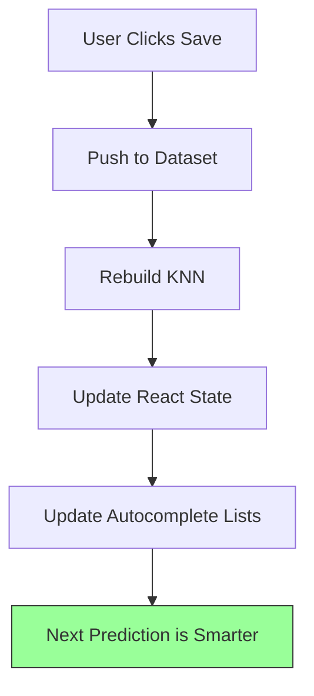

# Building a "Human-in-the-Loop" Interface for Local AI (Part 1)

**Topic:** The "Body" (UI/UX)
**Stack:** React, Tailwind, Heroicons

In the previous posts, we built the "Brain" of our WeeMap Scanner. It can do math, crop images, and learn from examples.

But when a user first opens the app, that Brain is empty. It knows nothing. It creates a UX problem known as the **Cold Start**.

If we just gave the user an "Analyze" button, they would click it, get 100% wrong answers (or "None"), and close the tab.

We needed a UI designed specifically for **Teaching**, not just consuming. This is often called a **"Human-in-the-Loop"** workflow.

---

## 1. The Inspector Pattern

The core interaction of the app isn't "Process Everything," it's "Teach One Thing."

We built the **Tile Inspector**, a modal that appears when you click any hex on the map. It serves three distinct purposes simultaneously:

1.  **Data Creation:** It captures the specific cropped image of that tile.
2.  **Labeling:** It provides input fields to define the Truth (Ground Truth).
3.  **Validation:** It runs a live prediction in the background to show what the AI *currently* thinks.


*> Caption: The Inspector Modal. Note the image preview on the left and the "AI Prediction" badges next to the input fields.*

### The "Sparkles" Badge
A small but crucial UX detail: inside the Inspector, we show the AI's current guess next to the input field.

*   **Scenario A:** The AI thinks a "Forest" is "Water."
    *   *User Action:* The user sees the error, types "Forest," and clicks Save.
    *   *Result:* The model learns.
*   **Scenario B:** The AI thinks a "Forest" is "Forest."
    *   *User Action:* The user sees the AI is correct. They might verify the unit owner and click Save.
    *   *Result:* Reinforcement.

This turns the tedious task of data entry into a game of "Correcting the AI."

## 2. Flexible Inputs vs. Strict Dropdowns

In machine learning, your "classes" (labels) usually need to be defined upfront. You have a fixed list: `['cat', 'dog', 'bird']`.

But in a generic tool like this, we don't know what game the user is playing. Is it *Advance Wars*? *Civ V*? *Wesnoth*?

*   One game calls it "Infantry."
*   Another calls it "Soldier."
*   Another calls it "Grunt."

We couldn't use hardcoded `<select>` dropdowns. Instead, we used HTML `<input list="...">` (datalists).

```tsx
<input 
    type="text"
    list="terrain-list"
    value={props.terrain} 
    onChange={e => handleChange('terrain', e.target.value)}
/>
<datalist id="terrain-list">
    {knownLabels.terrain.map(l => <option key={l} value={l} />)}
</datalist>
```

**Why this matters:**
1.  **Freedom:** The user can type *anything*. If they type "Super Tank," the system accepts it, creates a new class in the TensorFlow classifier dynamically, and adds it to the "Known Labels" list.
2.  **Speed:** Once "Super Tank" exists, it appears in the autocomplete for the next tile.

## 3. The Feedback Loop: Save = Train

In a traditional web app, "Save" usually means "Send data to database."

In this local AI app, "Save" triggers a chain reaction:



1.  **Commit:** The image and label are pushed to the `dataset` array.
2.  **Retrain:** The KNN classifier is effectively updated instantly (since KNN just stores the vector).
3.  **Update UI:** The "Known Labels" sidebar updates to include any new terms.

This happens in milliseconds. The user labels a "Red Tank," and the *very next* tile they click will likely be correctly identified as a "Red Tank."

This immediate gratification is the secret sauce. It encourages the user to keep providing data because they can *see* the system getting smarter in real-time.

---

*In the next section, we’ll look at the technical challenges of rendering the Grid Overlay and managing the React state.*
