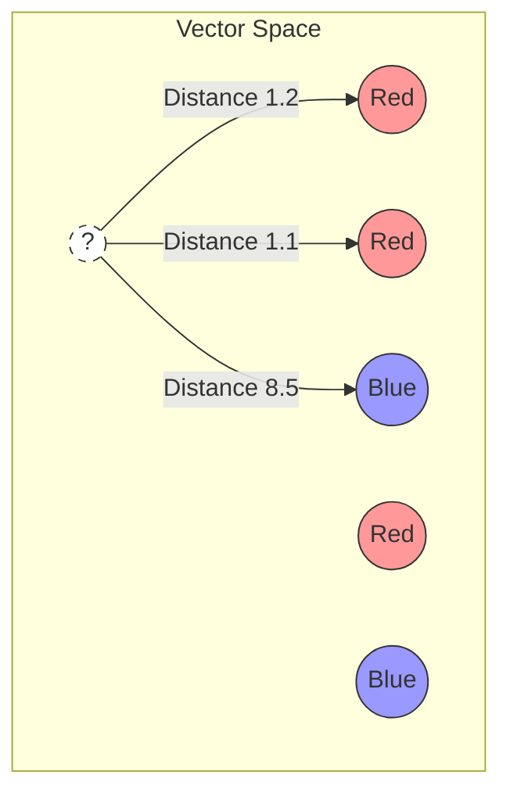

# The "Lazy" Algorithm that Powers Our Hex Scanner: A Deep Dive into KNN (Part 3)

**Topic:** Machine Learning Theory
**Key Concepts:** K-Nearest Neighbors, Classification vs. Regression, Euclidean Distance, Vector Space

In Part 1 and 2, we built **WeeMap Scanner**, a tool that reverse-engineers strategy games in the browser. We mentioned that the "Brain" of the operation was a **K-Nearest Neighbors (KNN)** classifier.

To a Data Scientist, KNN is "Baby's First Algorithm." It’s often dismissed because it doesn't have "Neurons" or "Transformers" or "Billions of Parameters."

But to a **Software Engineer**, KNN is a superpower. It is arguably the most useful, interpretable, and flexible algorithm you can have in your toolkit.

In this post, we are going to look under the hood of KNN, explain why it was the perfect choice for our Hex Scanner, and how you can use it for things like **Resource Prediction** or **Recommendation Engines**.

---

## 1. The Intuition: The "Vibe Check"

Most Machine Learning algorithms (like Neural Networks or Linear Regression) are **Eager Learners**.
1.  You give them data.
2.  They crunch numbers for hours to find a mathematical formula (weights) that represents that data.
3.  They throw away the original data.
4.  They use the formula to predict.

KNN is a **Lazy Learner**.
1.  You give it data.
2.  It saves the data in a list.
3.  That's it. It's done "training."

When you ask KNN for a prediction, it wakes up and performs a "Vibe Check." It looks at the new input and asks: **"Which of the examples I've already seen does this look the most like?"**

### The Geometry
Imagine a 2D plot.
*   You have a cluster of **Red** dots at coordinates `(1, 1)`.
*   You have a cluster of **Blue** dots at coordinates `(9, 9)`.

If I drop a new dot at `(2, 2)`, KNN calculates the distance to every other dot. It sees that the 3 closest dots are all **Red**. Therefore, the new dot is likely **Red**.

In our WeeMap Scanner, we aren't using X/Y coordinates. We are using **Embeddings** from MobileNet. These are arrays of 1,024 numbers. But the math is exactly the same - we are just calculating distance in 1,024-dimensional space instead of 2D space.

## 2. Classification vs. Regression (The Gold Mine Problem)

In our app, we use KNN for **Classification**. We want to pick a label from a distinct list (Forest, Mountain, Water).

**How it works (Voting):**
1.  Find the `K` (e.g., 3) nearest neighbors.
2.  Neighbors: `[Forest, Forest, Grass]`
3.  Vote: Forest (2), Grass (1).
4.  **Result: Forest.**

### But what if we want to predict numbers?
A reader asked a great question: *“What if different tiles generate a different amount of coins? Can we predict that?”*

This is where KNN shines. We simply switch from **Voting** to **Averaging**. This is called **KNN Regression**.

**How it works (Averaging):**
Let's say you train the model by clicking tiles and entering their Gold Yield.
1.  User clicks Tile A: "This yields 50 gold."
2.  User clicks Tile B: "This yields 60 gold."

Now we predict a new Unknown Tile.
1.  Find `K` nearest neighbors.
2.  Neighbors: `[Tile A (50g), Tile A (50g), Tile B (60g)]`.
3.  Math: `(50 + 50 + 60) / 3`.
4.  **Result: 53.33 gold.**

You can even get fancy and use **Weighted Averaging**, where neighbors that are *closer* have more influence on the final number.

## 3. Why KNN was Perfect for this App

### Pro: Instant "Training"
Because KNN is "Lazy," training time is $O(1)$. It's instant.
In a "Human-in-the-Loop" tool, this is critical. The user labels a tile, clicks Save, and expects the *very next* tile they hover over to use that new knowledge. If we used a Neural Network, the user would have to wait 10-20 seconds for a "Backpropagation" step every time they clicked Save.

### Pro: It Supports "Few-Shot" Learning
Neural Networks usually need thousands of examples to converge. KNN works with just one. If you have one example of a "Tank," and the new image is identical to that "Tank," the distance is 0. It matches perfectly.

### Con: The Performance Cost
The downside of "Lazy" learning is "Expensive" predicting.
To make a prediction, KNN has to measure the distance between the new image and *every single example* in memory.

*   10 examples: Instant.
*   1,000 examples: Fast.
*   1,000,000 examples: **Slow.**

For our Hex Scanner, a user might create 50-100 examples max. Browsers can handle that math in microseconds. But you wouldn't use raw KNN to classify YouTube videos (billions of items) without fancy optimization structures like KD-Trees.

## 4. KNN in the Real World

You interact with KNN algorithms every day.

1.  **Recommendation Engines (Spotify/Netflix):**
    *   They turn "You" into a vector based on your listening history.
    *   They turn "Songs" into vectors.
    *   They look for Song vectors that are close to your User vector.
    *   *“Users who are close to you also liked...”* is basically finding your Nearest Neighbors in user-taste space.

2.  **Anomaly Detection (Credit Card Fraud):**
    *   Bank transactions usually cluster in a specific area (e.g., $5-$100, local location).
    *   If a transaction appears that is huge distance away from your "Cluster of Normal Behavior," it is flagged as fraud.

3.  **Color Matching (Sherwin-Williams App):**
    *   You take a photo of a wall.
    *   The app converts that RGB pixel to a vector.
    *   It searches its database of paint colors to find the Nearest Neighbor.

## Conclusion

KNN is the "Swiss Army Knife" of Machine Learning. It’s simple, it’s interpretable (you can literally look at the neighbors to see *why* it made a decision), and it handles both categories and numbers with ease.

For **WeeMap Scanner**, it allowed us to build a trainable AI system that feels responsive and magical, without needing a backend server.

